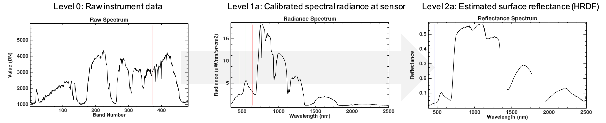

# SBG VSWIR Surface Reflectance – Algorithm Theoretical Basis Document (ATBD)

**David R. Thompson*1

1Jet Propulsion Laboratory, California Institute of Technology

Corresponding author: David R. Thompson (david.r.thompson@jpl.nasa.gov)

**Key Points:**

**Version:** 1.0

**Release Date:** TBD

**DOI:** TBD

# Abstract

# Plain Language Summary

## Keywords: surface reflectance, spectroscopy, radiative transfer

# 1 Version Description

This is Version 1.0 of the SBG VSWIR surface reflectance algorithms.

# 2 Introduction

Following on recommendations by the National Academies of Science, Engineering and Medicine in their 2017 Decadal Survey on Earth Sciences, the National Aeronautics and Space Administration (NASA) selected the Surface Biology and Geology (SBG) mission for implementation as part of its Earth System Observatory (ESO). SBG in particular aims to measure properties of the Earth’s surface composition and ecology. It is comprised of two platforms: a wide-swath thermal infrared instrument on a free-flying spacecraft in a polar orbit with an afternoon equatorial crossing time; and a separate spacecraft carrying a wide-swath solar reflectance imaging spectrometer operating in the Visible Shortwave Infrared (VSWIR), with a morning equatorial crossing time. SBG-VSWIR will measure the solar reflected range at approximately 380-2500 nm at 10 nm spectral sampling, over a 180 km swath with 30 m spatial sampling. This measurement enables repeat coverage of any location on Earth every 16 days. The visible-shortwave infrared range is sensitive to diverse physical processes in the Earth’s surface and atmosphere (Cawse-Nicholson 2021). The spectral, spatial, and radiometric resolutions of the SBG VSWIR instrument will enable Earth-system-scale measurements of aquatic ecosystems, including biogeochemistry products across inland, nearshore coastal, and open ocean ecosystems.

This document describes the algorithms used to estimate the surface reflectance spectra, specifically the hemispherical directional reflectance factors (HDRFs), from the top of atmosphere radiance spectra. 

# 3 Context/Background and Historical Perspective

Atmospheric correction (Thompson et al., 2019) has a multi-decadal history of use for imaging spectrometers viewing the Earth surface.  This on airborne precursor instruments such as NASA’s “Classic” Airborne Visible Infrared Imaging Spectrometer (AVIRIS-C, Green et al., 1998) and has been extended to its next generation counterpart (AVIRIS-NG, Thompson et al., 2017). Such analyses have been conducted in dozens of campaigns over decades of successful operations.  Many empirical methods based on scene averaging (Kruse 1988), flat fielding (Roberts et al., 1986), QUAC (Bernstein et al., 2005), and cloud shadow methods (Reinersman et al., 1998) are useful but do not scale to global observations with diverse scene content and sparse field data. ).  They rely either on manual intervention, or on specific characteristics of the scene such as a spatially homogeneous atmosphere or known scene content, precluding their use with EMIT.  Instead, we favor a physically-motivated correction based on radiative transfer models. These have the dual advantages of superior generalizability across scenes without the need for manual intervention in the analysis, and physical interpretability.  

Recent reviews surveying different atmospheric alternatives appear in Thompson et al. (2019), Ientilucci and Adler-Golden (2019), and for aquatic spectra, Frouin et al. (2019).   Broadly speaking, physically-based methods themselves fall into two general categories (Frouin et al., 2019). Sequential methods first estimate atmospheric properties based on analysis of the radiance spectrum, and then invert the radiance directly via closed-form algebra to estimate the surface reflectance.  In other words, atmosphere and surface are estimated in two independent steps.  Existing physics-based atmospheric correction codes designed for imaging spectrometers all use this general method.  They include ACORN (Kruse et al., 2004), ATCOR (Richter and Shlaepferm 2002), ATREM (Gao, 1993) and the AVIRIS-NG standard approach derived from ATREM (Thompson et al., 2015).

Alternatively, simultaneous methods estimate surface and atmosphere simultaneously, as in Bayesian Maximum A Posteriori estimation (Thompson et al., 2018, 2019b).  Simultaneous methods carry several advantages that are crucial for the EMIT mission.  First, they enable rigorous uncertainty accounting.  Uncertainty accounting on the input side means respecting instrument noise in the radiance data which can vary by surface type, observing conditions, and wavelength, as well as incorporating any prior background knowledge available in the form of statistical priors.  The ability to seamlessly account for these factors makes the Bayesian inversion a flexible and powerful approach to achieve SBG-VSWIR’s extreme sensitivity requirements.  On the output side, uncertainty accounting lets the algorithm propagate posterior uncertainty estimates downstream, where they can improve the performance of mineral fitting algorithms (Thompson et al., 2020b).  A second independent benefit of the simultaneous model inversion approach is the demonstrated ability to use the entire spectral range of acquisition in the atmospheric correction, enabling estimation of subtler broad atmospheric perturbations such as aerosols (an SBG-VSWIR product, in the form of an AOD mask). The main disadvantage is that the methods use an iterative algorithm, leading to higher computational demands.  

The SBG-VSWIR mission borrows an approach used operationally in past years by the EMIT mission: a Bayesian model inversion strategy, known colloquially in the atmospheric sounding community as Optimal Estimation (OE, e.g. Rodgers 2000), with careful application of geospatial interpolation to glean the benefits of both while minimizing cost.  The specific OE-based approach used in SBG-VSWIR has been validated by decades of operational use by NASA’s atmospheric remote sounding spectrometers on many missions and millions of acquisitions (Rodgers 2000), and for VSWIR spectral ranges by the EMIT mission (Thompson et al., 2024; Coleman et al., 2024). It has also been validated though peer-reviewed field studies with over 20 in situ validation trials of surface reflectance in airborne campaigns over synthetic, water, vegetated, and bare terrain (Thompson et al., 2018, Thompson et al., 2019b, Thompson et al., 2019c, Thompson et al., 2020).  Outside the imaging spectroscopy community, the OE approach has been In situ measurement protocols have also been vetted by decades of continuing operational use.  The code used is distributed as open source through the public repository at https://github.com/isofit/isofit/.  This transparency helps for finding errors, and also for end users who desire details on the implementation specifics (e.g. data layout in memory, command flow, etc.).  The code will undergo continuing development by a growing community of users throughout the SBG mission.

Figure 1: Raw, Radiance, and Reflectance Spectra

# 4 Algorithm Description

The Bayesian Model inversion acts as a local ascent of the posterior probability density for a state vector x consisting of surface and atmosphere parameters (Figure 2).  As in Thompson et al. (2018) we initialize the result to a heuristic estimate  using a band ratio across water vapor absorption features, and an algebraic inversion of equation (1). Then, an iterative gradient-based Levenberg Marquardt follows the (negative) derivative of the following cost function until converging to a local minimum:
 (2)

The first term is related to the logarithm of the multivariate data likelihood at the current state vector; the second term penalizes departures from the prior in similar fashion.  All probability distributions are multivariate Gaussians.  Here Ψ_L is the observation noise that incorporates measurement noise in the radiance measurement x ̂_L as well as any unknowns in the surface atmosphere system that are treated here as random variables.  The forward model F(x_r) maps the reflectance and atmosphere state vector, x_r, to the measurement space using Lookup table interpolation of optical coefficients in Equation 1.  The multivariate Gaussian prior over surface and atmosphere is defined by Covariance matrix Σ_rand mean μ_r. These priors are intentionally set to be extremely broad in order to avoid estimation bias in atmospheric parameters.  Similarly, we use a very loose and heavily regularized surface prior.  It is based on a collection of multivariate Gaussians, as suggested in Thompson et al., (2018, 2019a, 2019b), using the Euclidean-nearest component of the initial state calculated in reflectance space as the prior. All spectra are L2-normalized for the purposes of calculating these distances and prior distributions so that the distribution affects the shape but not the magnitude of spectra. The only difference with the formulation in these previous studies is that all wavelengths outside critical atmospheric windows are left entirely decorrelated.  This allows instrument noise to enter the reflectance estimate unmodified, and permits accurate retrieval of absorption features in mineral bands. 

## 4.1 Surface Model

### 4.2 Atmospheric Radiative Transfer Model

### 4.3 Noise Model

## 4.4 Algorithm Input Variables
## 4.5 Algorithm Output Variables

# 5 Algorithm Usage Constraints

# 6 Performance Assessment

## 6.1 Validation Methods

## 6.2 Uncertainties

## 6.3 Validation Errors

# 7 Algorithm Implementation

## 7.1 Algorithm Availability

## 7.2 Input Data Access

## 7.3 Output Data Access

## 7.4 Important Related URLs

# 8 Significance Discussion

# 9 Open Research

# 10 Acknowledgements

# 11 Contact Details

# References
